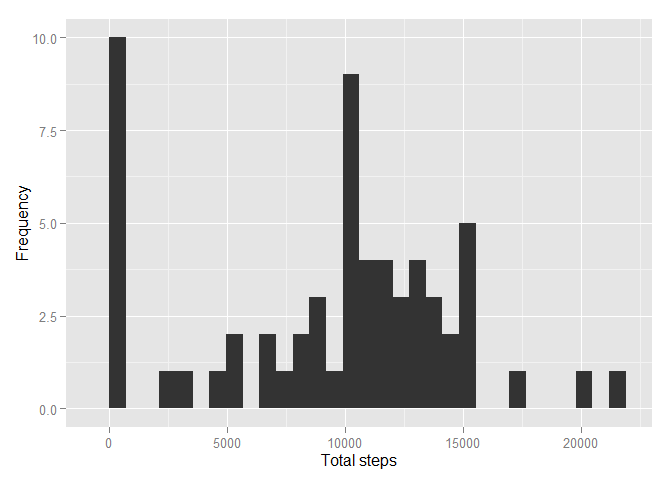
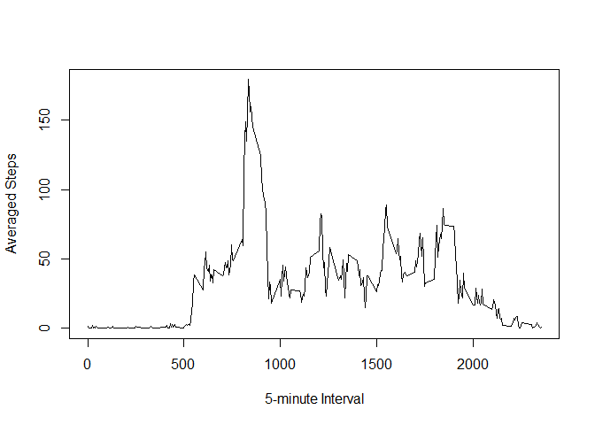
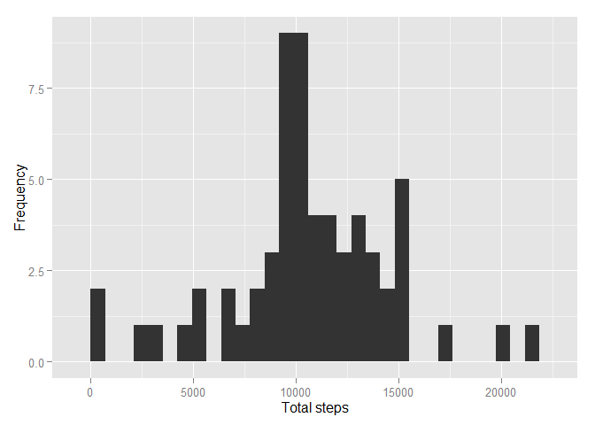
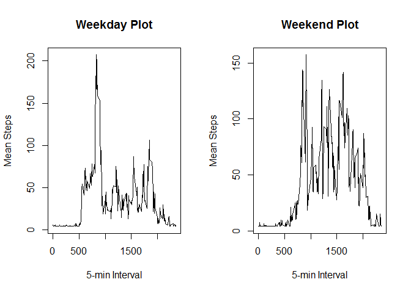

# Reproducible Research: Peer Assessment 1

## **Set global environment**


```r
library(reshape2)
library(knitr)
library(ggplot2)
opts_chunk$set(echo=TRUE)
```


## **Loading and preprocessing the data**

Read data


```r
if(!file.exists('activity.csv')){
    unzip('activity.zip')
}
activity <- read.csv('activity.csv')
```

Explore data


```r
names(activity)
```

```
## [1] "steps"    "date"     "interval"
```

```r
str(activity)
```

```
## 'data.frame':	17568 obs. of  3 variables:
##  $ steps   : int  NA NA NA NA NA NA NA NA NA NA ...
##  $ date    : Factor w/ 61 levels "2012-10-01","2012-10-02",..: 1 1 1 1 1 1 1 1 1 1 ...
##  $ interval: int  0 5 10 15 20 25 30 35 40 45 ...
```

```r
head(activity, n = 10)
```

```
##    steps       date interval
## 1     NA 2012-10-01        0
## 2     NA 2012-10-01        5
## 3     NA 2012-10-01       10
## 4     NA 2012-10-01       15
## 5     NA 2012-10-01       20
## 6     NA 2012-10-01       25
## 7     NA 2012-10-01       30
## 8     NA 2012-10-01       35
## 9     NA 2012-10-01       40
## 10    NA 2012-10-01       45
```


## **What is mean total number of steps taken per day?**

Replace missing values in 'steps' by 0


```r
activity$steps[is.na(activity$steps)] = 0
```

Calculate the total number of steps taken per day


```r
activity_melt = melt(activity, id.vars = 'date', measure.vars = 'steps')
DailyStepsTotal = dcast(activity_melt, date ~ variable, sum)
```

Make a histogram of the total number of steps taken each day


```r
qplot(DailyStepsTotal$steps, xlab = "Total steps", ylab = "Frequency")
```

```
## stat_bin: binwidth defaulted to range/30. Use 'binwidth = x' to adjust this.
```

 

Calculate and report the mean and median of the total number of steps taken per day


```r
mean(DailyStepsTotal$steps)
```

```
## [1] 9354.23
```

```r
median(DailyStepsTotal$steps)
```

```
## [1] 10395
```

The above calculations provide a mean and median of **9354** and **10395** respectively


## **What is the average daily activity pattern?**

Calculate the average steps across all dates per 5-minute interval


```r
activity_melt2 = melt(activity, id.vars = 'interval', measure.vars = 'steps')
AverageSteps = dcast(activity_melt2, interval ~ variable, mean)
```


Make a time series plot of the 5-minute interval (x-axis) and the average number of steps taken, averaged across all days (y-axis)


```r
plot(AverageSteps, type = 'l', xlab = '5-minute Interval', ylab = 'Averaged Steps')
```

 


Find out which 5-minute interval, on average across all the days in the dataset, contains the maximum number of steps


```r
which(AverageSteps$steps == max(AverageSteps$steps))
```

```
## [1] 104
```

```r
AverageSteps$interval[104]
```

```
## [1] 835
```

The **835**th interval contains the maximum number of steps across all days 

## **Imputing missing values**

Re-load data with missing values (we previously replaced missing values by 0)


```r
activity2 = read.csv('activity.csv')
```

Calculate and report the total number of missing values in the dataset


```r
sum(is.na(activity2$steps))
```

```
## [1] 2304
```

We have **2304** rows with missing values in 'steps'


Calculate the averaged steps within a 5-minute interval across days


```r
replaceData = mean(AverageSteps$steps)
```


Create a new dataset that is equal to the original dataset but with the missing data filled by the averaged steps within a 5-minute interval across days


```r
NAid = which(is.na(activity2$steps))
for (i in NAid){
    activity2$steps[i] = as.numeric(replaceData)}
```

Make a histogram of the total number of steps taken each day


```r
activity2_melt = melt(activity2, id.vars = 'date', measure.vars = 'steps')
DailyStepsTotal2 = dcast(activity2_melt, date ~ variable, sum)
qplot(DailyStepsTotal2$steps, xlab = "Total steps", ylab = "Frequency")
```

```
## stat_bin: binwidth defaulted to range/30. Use 'binwidth = x' to adjust this.
```

 


Calculate and report the mean and median of the total number of steps taken per day


```r
mean(DailyStepsTotal2$steps)
```

```
## [1] 10581.01
```

```r
median(DailyStepsTotal2$steps)
```

```
## [1] 10395
```


These values differ from the estimates from the first part of the assignment. The impact of imputing missing values is having more data, resulting in a bigger mean and median value.

## **Are there differences in activity patterns between weekdays and weekends?**

Create a new factor variable in the dataset with two levels - "weekday" and "weekend" indicating whether a given date is a weekday or weekend day


```r
activity2$days = weekdays(as.Date(activity2$date))

weekfactor = function(day){
    if (day %in% c('Saturday', 'Sunday')) {
        return('weekend')}
    else {
        return('weekday')
        }
    }

activity2$weekfac = lapply(activity2$days, weekfactor)
```


Make a panel plot containing a time series plot (i.e. type = "l") of the 5-minute interval (x-axis) and the average number of steps taken, averaged across all weekday days or weekend days (y-axis)


```r
activity_melt3 = melt(activity2, id.vars = c('weekfac','interval'), measure.vars = 'steps')
WeekdayAve = dcast(activity_melt3[activity_melt3$weekfac == 'weekday', ], interval ~ variable, mean)
WeekendAve = dcast(activity_melt3[activity_melt3$weekfac == 'weekend', ], interval ~ variable, mean)

par(mfrow = c(1, 2))
plot(WeekdayAve, type = 'l', main = 'Weekday Plot', xlab = '5-min Interval', ylab = 'Mean Steps')
plot(WeekendAve, type = 'l', main = 'Weekend Plot', xlab = '5-min Interval', ylab = 'Mean Steps')
```

 


You can refer to the figures above regarding the pattern difference between weekdays and weekends


